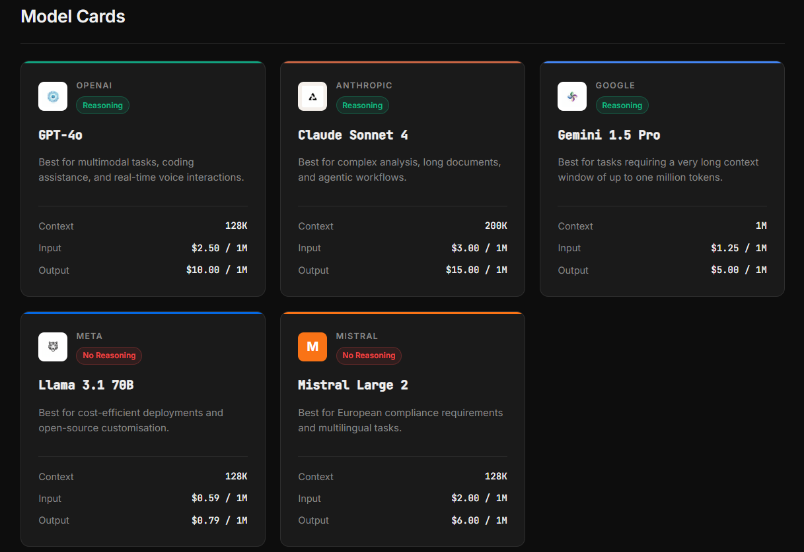
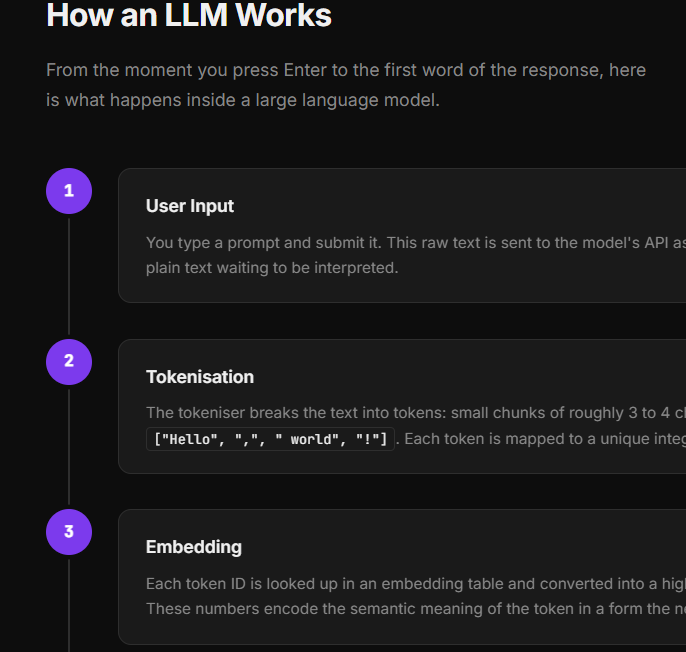

# BONUS Lab 02 - LLM Model Cards 🃏



## Introduction

In BONUS Lab 01 you built the structure of an LLM Dashboard using semantic HTML. The page works, but it looks like a plain document from the 1990s 😅

In this lab you will bring it to life with CSS.

You will do two things. First, you will add a **Model Cards Gallery** to your existing dashboard: a visual grid of cards that makes it easy to compare LLMs at a glance. Second, you will create a **brand new page** that explains how an LLM actually works, styled as an animated vertical timeline.

By the end of this lab you will have a multi-page mini-site that looks like a real product.

<br>

## Learning Objectives

By the end of this lab, you will be able to:

* Link an external CSS stylesheet to an HTML page
* Use Flexbox and CSS Grid to build responsive layouts
* Style cards with borders, shadows, and hover effects
* Use CSS custom properties (variables) to manage a colour palette
* Create a vertical timeline using pseudo-elements (`::before` and `::after`)
* Navigate between pages using anchor tags

<br>

## Getting Started

1. Continue with the previous project repo (you will share the same link).
2. Create a new file called `styles.css` in the same folder.
3. Link the stylesheet inside the `<head>` of `index.html`:

```html
<link rel="stylesheet" href="styles.css">
```

4. Open `index.html` in your browser: you are ready to start.

<br>

## Part 1: CSS Foundations

### Step 1: Set Up Your Colour Palette with CSS Variables

At the top of `styles.css`, declare a set of custom properties inside `:root`. This is your single source of truth for all colours. Every colour you use in the rest of the file must come from one of these variables: no hardcoded hex values allowed anywhere else.

```css
:root {
  --color-background: #0d0d0d;
  --color-surface: #1a1a1a;
  --color-border: #2e2e2e;
  --color-text-primary: #f0f0f0;
  --color-text-secondary: #888888;
  --color-accent: #7c3aed;
  --color-accent-hover: #6d28d9;
}
```

Feel free to change the colors to match your own taste.

<br>

### Step 2: Style the Base Layout

Apply global styles to the `body`, `header`, `nav`, `main`, and `footer`. At minimum:

* Set `background-color` and `color` using your variables
* Choose a font from [Google Fonts](https://fonts.google.com) and import it
* Give the `header` a bottom border and some padding
* Style the `nav` links so they are horizontal, have no underline, and change colour on hover
* Give the `footer` a top border and a smaller font size

<br>

### Step 3: Style the Comparison Table

Make the existing comparison table from Lab 01 look polished:

* Remove the default table borders and add your own using `border-collapse` and `var(--color-border)`
* Highlight the header row with the accent colour
* Style the reasoning column cells so the ✓ symbol appears in green and the ✗ symbol appears in red

<br>

## Part 2: Model Cards Gallery

### Step 4: Add the Cards Section to index.html

Below the comparison table section, add a new section to your `index.html`:

```html
<section id="model-cards">
  <h2>Model Cards</h2>
  <div class="cards-grid">
    <!-- one .card div per model -->
  </div>
</section>
```

Create **at least five cards**, one for each LLM in your comparison table. Each card must follow this structure:

```html
<div class="card">
  <div class="card-header">
    <span class="card-provider">Anthropic</span>
    <span class="card-reasoning reasoning-yes">Reasoning</span>
  </div>
  <h3 class="card-name">Claude Sonnet 4</h3>
  <p class="card-tagline">Best for complex analysis and long documents</p>
  <ul class="card-specs">
    <li><span class="spec-label">Context</span><span class="spec-value">200K</span></li>
    <li><span class="spec-label">Input</span><span class="spec-value">$3 / 1M</span></li>
    <li><span class="spec-label">Output</span><span class="spec-value">$15 / 1M</span></li>
  </ul>
</div>
```

Each card must include:

* The **provider name** as a small label
* The **model name** as a heading
* A short **tagline** describing what the model is best for (write this yourself — one sentence)
* A **specs list** with context window, input price, and output price
* A **reasoning badge**: use class `reasoning-yes` for models that support reasoning and `reasoning-no` for those that do not

<br>

### Step 5: Style the Cards

In `styles.css`, style the cards section:

* Give each card a background of `var(--color-surface)`, a border of `var(--color-border)`, and a `border-radius`
* Add a `box-shadow` and a smooth `transition` so the card lifts on `:hover`
* Style `.reasoning-yes` with a green background and `.reasoning-no` with a red background

<br>

## Part 3: How It Works: A New Page



### Step 6: Create how-it-works.html

Create a new file called `how-it-works.html` in the same folder. Give it a proper HTML structure with `<!DOCTYPE html>`, `<head>`, and `<body>`. Link the same `styles.css` file.

The page must have:

* The same `<header>` and `<nav>` as `index.html`
* A `<main>` containing a single section with `id="timeline"`
* The same `<footer>`

<br>

### Step 7: Add the Timeline Content

Inside the timeline section, explain how an LLM processes a prompt using the following six steps. Use an ordered list `<ol class="timeline">` where each item is a `<li class="timeline-step">`:

1. **User Input**
2. **Tokenisation**
3. **Embedding**
4. **Attention Layers**
5. **Prediction**
6. **Output Generation**

Each `<li>` must contain:

```html
<li class="timeline-step">
  <div class="step-marker">1</div>
  <div class="step-content">
    <h3>User Input</h3>
    <p>The user types a prompt into the interface.</p>
  </div>
</li>
```

<br>

### Step 8: Style the Timeline

This is the most challenging part of the lab. You will draw the vertical connecting line using a CSS [pseudo-element](https://developer.mozilla.org/en-US/docs/Web/CSS/Reference/Selectors/Pseudo-elements): no extra HTML needed. 

Requirements:

* The `.timeline` list must have `list-style: none`, `padding: 0`, and `position: relative`
* Use `.timeline::before` to draw a vertical line down the centre-left of the list. Set `content: ""`, `position: absolute`, a fixed `left` value, `top: 0`, `bottom: 0`, a `width` of `2px`, and a background colour using your accent variable
* Each `.step-marker` must be a circle (use `border-radius: 50%`) positioned over the vertical line
* Each `.step-content` must sit to the right of the marker with a `margin-left` large enough to clear the line
* Add a CSS `@keyframes` animation called `fadeInUp` that moves each step from `opacity: 0` and `translateY(20px)` to `opacity: 1` and `translateY(0)`. Apply it to each `.timeline-step` with a staggered delay using `:nth-child` selectors

<br>

### Step 9: Link the Pages Together

In the `<nav>` of `index.html`, add a link to `how-it-works.html`:

```html
<a href="how-it-works.html">How It Works</a>
```

In the `<nav>` of `how-it-works.html`, add a link back:

```html
<a href="index.html">Dashboard</a>
```

Test that clicking between the two pages works correctly.

<br>

## HTML File Structure

Your `index.html` must now include these sections in order:

```
<header> ... </header>
<nav> ... </nav>
<main>
  <section id="what-is-llm"> ... </section>
  <section id="what-is-token"> ... </section>
  <section id="comparison"> ... </section>
  <section id="model-cards"> ... </section>
</main>
<footer> ... </footer>
```

Your `how-it-works.html` must include:

```
<header> ... </header>
<nav> ... </nav>
<main>
  <section id="timeline"> ... </section>
</main>
<footer> ... </footer>
```

<br>

:heart: **Happy coding!** Can't wait to see what's next...
